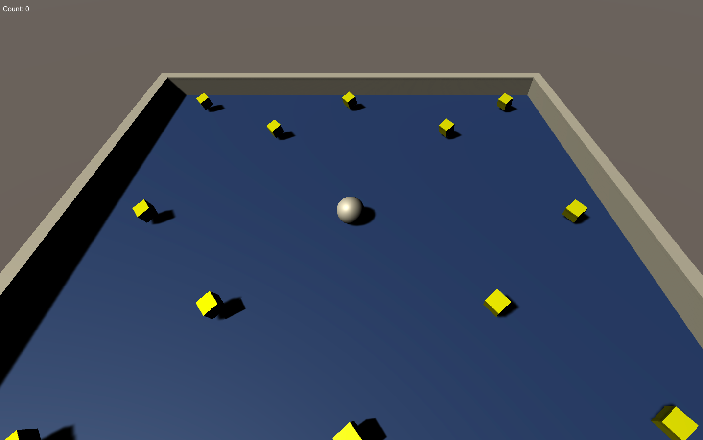

# Roll A Ball Game

Welcome to my first game created using Unity. Download this repository as a zip file, uncompress it and allow your computer to run the file! On a Mac you should be able to see an app file and run it directly. You will need to change your security settings to allow to intall app outside of the app store. Now you can open the game and after you are done playing press cmd + q to quit.

You can go into the Screenshots folder if you need help running the app

